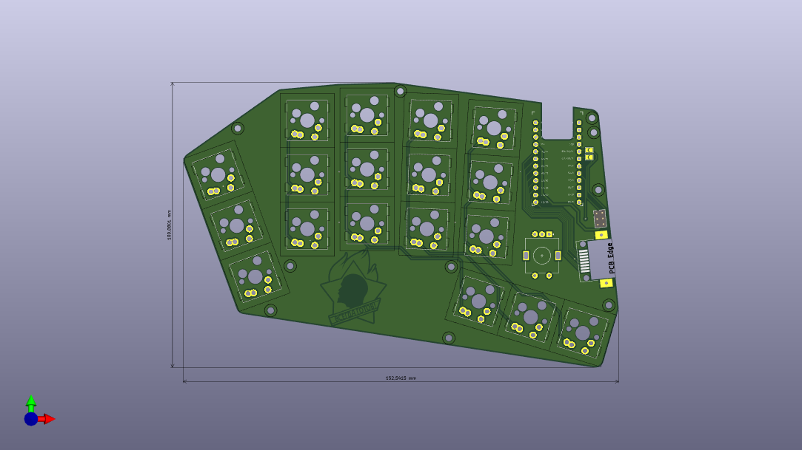
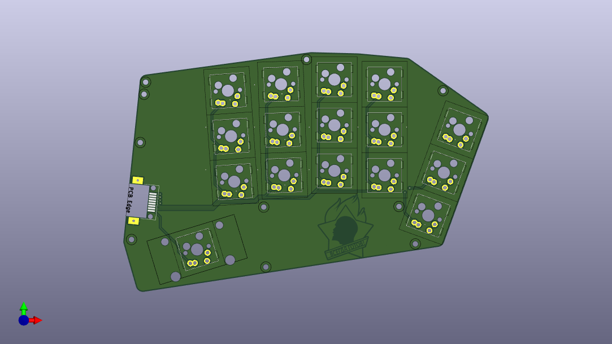

## SEPR34

The SEPR34 keyboard is a is a [Reviung34split](https://github.com/gtips/reviung/tree/master/reviung34split) fork with single ProMicro, hotswap socket and soldered-in switches support and little addition. The firmware is fully compatible.
This is a WIP.

## Parts
As for the parts list, you will need:
- 2x PCB (The left and right half are different)
- 34 MX or GLP keyswitches
- 34 MX keycaps (MX low-profile for the GLP)
- 34 Hotswap sockets for MX (optional)
- 2x [Ethernet sockets](https://aliexpress.com/item/32974903992.html)
- 1x ProMicro (Warning. I don't have possibility to test ALL clones, so, please, choose cearfully)

## Gerbers
You can find the Gerber files needed to order the PCB on the  directory. Look for the .zip of whatever version you would like!

## Attention
I'm a hobbyist/amateur at best. So there may be things that aren't optimized. So if you decide to use this, then please be advised that I'm not providing any sort of liability and you should exercise some caution. Use these file for your own risk. Thanks Sebastian Stumpf for this text.
